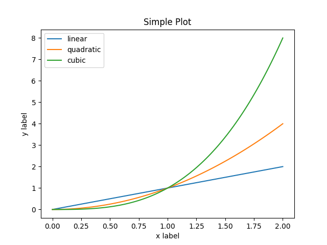
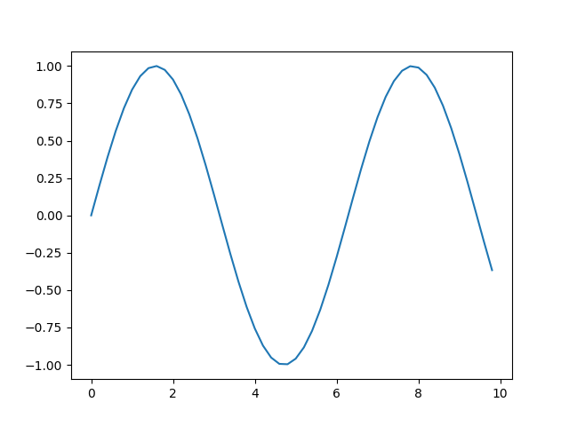

## Introdução

O python é uma linguagem de programação interpretada e de alto nível. Criada por Guido van Rossum e lançada em 1991, o python tem uma filosofia de design que enfatiza a legibilidade do código, usando a identação para separar os blocos de código. O python possui tipagem dinâmica e gerenciamento de memória automático. Tem suporte para uma variedade de paradigmas de programação, que incluem, o orientado a objetos, imperativo, funcional e procedural.

```python
x = 1
if x == 1:
  print ("Hello Python!")
``` 

## Instalação

### Windows

#### Step 1: Faça o download do instalador
1. Abra o navegador e vá até a página de [download para Windows](https://www.python.org/downloads/windows/) em [python.org](https://www.python.org/).

2. Na lista de links onde diz Python Releases for Windows, clique no link com a última versão do python 3.6.x (o qual usaremos nesse mini-tutorial).

3. Seleciona a opção _Windows x86-64 executable installer_ para sistemas de 64-bit ou _Windows x86 executable installer_ para 32-bits.

#### Step 2: Execute o instalador

Uma vez escolhido e feito o download do instalador, basta executá-lo. Uma janela como essa irá abrir: 

**Importante:** Tenha certeza que você marcou a opção que diz Adicione Python 3.x to PATH como mostrado acima para que o interpretador seja colocado no local de execução.

Após isso, apenas clique em Instalar.

### Linux

Nas distribuições do Ubuntu 17.10 e Ubuntu 18.04, o python 3.6 já vem instalado por padrão.

Nas distribuições do Ubuntu 16.10 e 17.04, o python não vem instalado por padrão porém o pacote já vem disponível no repositório universal, não sendo necessário realizar o primeiro passo.

Nas outras distribuições do Ubuntu e no Linux Mint os passos abaixo são todos necessários.

```
$ sudo add-apt-repository ppa:deadsnakes/ppa
$ sudo apt-get update
$ sudo apt-get install python3.6
``` 

## Um Pouco de Python

Aqui teremos uma seção em que usaremos o python para resolver uma série de problemas relacionados à engenharia. Apresentaremos algumas bibliotecas que nos ajudarão nesse processo e algumas funções também.

Nesse primeiro exemplo, temos um método simples para calcular a raiz quadrada de um número. Neste caso é usado o **método de Newton**.

```python

print('Método de Newton: cálculo da raiz quadrada')
arg = float(input('Valor do argumento: '))
iter = int(input('Número de iterações: '))

x = 1
for i in range(iter)
  x = x - (x**2 - arg) / (2 * x)
  
print('Raiz quadrada:', x)

```

## NumPy

NumPy é uma biblioteca do Python muito útil para realizar várias operações. Entre essas operações, destaca-se o uso de matrizes. Nessa biblioteca, utiliza-se um array de duas dimensões para realizar operações com matrizes. Existem várias funções para criar uma matriz, uma muito útil é a `zeros`. 

```python

>>> import numpy as np
>>> np.zeros((5, 5))
array([[ 0.,  0.,  0.,  0.,  0.],
       [ 0.,  0.,  0.,  0.,  0.],
       [ 0.,  0.,  0.,  0.,  0.],
       [ 0.,  0.,  0.,  0.,  0.],
       [ 0.,  0.,  0.,  0.,  0.]])
       
```

A função `array` também é utilizada para se criar uma matriz.

```python

>>> b = np.array([(1.5,2,3), (4,5,6)])
>>> b
array([[ 1.5,  2. ,  3. ],
       [ 4. ,  5. ,  6. ]])
>>> type(b)
<type 'numpy.ndarray'>
>>> b.dtype
dtype('int64')

```

Para criar sequências numéricas em matrizes, o Numpy oferece uma função análoga ao `range` do Python que retorna array ao invés de listas.

```python

>>> np.arange( 10, 30, 5 )
array([10, 15, 20, 25])
>>> np.arange( 0, 2, 0.3 )                         # aceita float
array([ 0. ,  0.3,  0.6,  0.9,  1.2,  1.5,  1.8])

```

A função `arange` combinada com a função `reshape` podem produzir matrizes com um número definido de linhas e colunas com valores em um intervalo especificado.

```python

>>> a = np.arange(15).reshape(3, 5)
>>> a
array([[ 0,  1,  2,  3,  4],
       [ 5,  6,  7,  8,  9],
       [10, 11, 12, 13, 14]])

```

### Operações Básicas

```python

>>> a = np.array( [20,30,40,50] )
>>> b = np.arange( 4 )
>>> b
array([0, 1, 2, 3])
>>> c = a-b           
>>> c
array([20, 29, 38, 47])             # é criado um novo array que é preenchido com o resultado
>>> b**2
array([0, 1, 4, 9])
>>> a<35
array([ True, True, False, False])

```

Ao contrário de várias outras linguagens, no Python, o operador `*` afeta elemento por elemento nos arrays do NumPy. Para realizar o produto entre duas matrizes, utiliza-se o operador `@` (python >= 3.5) ou a função `dot`.

```python

>>> A = np.array( [[1,1],
...             [0,1]] )
>>> B = np.array( [[2,0],
...             [3,4]] )
>>> A * B                       # produto elemento a elemento
array([[2, 0],
       [0, 4]])
>>> A @ B                       # produto matricial
array([[5, 4],
       [3, 4]])
>>> A.dot(B)                    # outro produto matricial
array([[5, 4],
       [3, 4]])

```

Algumas operações úteis que também estão definidas na classe `ndarray`.

```python

>>> a = np.random.random((2,3))
>>> a
array([[ 0.18626021,  0.34556073,  0.39676747],
       [ 0.53881673,  0.41919451,  0.6852195 ]])
>>> a.sum()
2.5718191614547998  # soma dos elementos da matriz
>>> a.min()
0.1862602113776709  # menor elemento da matriz
>>> a.max()
0.6852195003967595  # maior elemento da matriz


>>> b = np.arange(12).reshape(3,4)
>>> b
array([[ 0,  1,  2,  3],
       [ 4,  5,  6,  7],
       [ 8,  9, 10, 11]])
>>>
>>> b.sum(axis=0)                            # soma de cada coluna
array([12, 15, 18, 21])
>>>
>>> b.min(axis=1)                            # mínimo de cada linha
array([0, 4, 8])

``` 

### Iteração e indexação em uma matriz

Arrays multidimensionais possuem um índice por eixo. Esses índices são dados em uma tupla separados por vírgula.

```python

>>> b
array([[ 0,  1,  2,  3],
       [10, 11, 12, 13],
       [20, 21, 22, 23],
       [30, 31, 32, 33],
       [40, 41, 42, 43]])

>>> b[2,3]
23

>>> b[ : ,1]                        # cada linha da segunda coluna
array([ 1, 11, 21, 31, 41])

```

Para realizar uma iteração elemento a elemento em uma matriz pode ser usado o atributo `flat` que é um iterador para todos os elementos da matriz.

```python

>>> for element in b.flat:
...     print(element)
...
0
1
2
3
10
11
12
13
20
21
22
23
30
31
32
33
40
41
42
43

```

### Outras operações

```python

>>> import numpy as np
>>> a = np.array([[1.0, 2.0], [3.0, 4.0]])
>>> print(a)
[[ 1.  2.]
 [ 3.  4.]]

>>> a.transpose()  # matriz transposta
array([[ 1.,  3.],
       [ 2.,  4.]])

>>> np.linalg.inv(a) # matriz inversa
array([[-2. ,  1. ],
       [ 1.5, -0.5]])

>>> u = np.eye(2) # matriz identidade 2x2
>>> u
array([[ 1.,  0.],
       [ 0.,  1.]])
>>> j = np.array([[0.0, -1.0], [1.0, 0.0]])

>>> j @ j        # produto matricial
array([[-1.,  0.],
       [ 0., -1.]])
       
>>> np.trace(u)  # traço da matriz
2.0

```

### Sistema linear com NumPy

Podemos facilmente resolver um sistema linear utilizando matrizes com o auxílio do NumPy. Existe uma sub-biblioteca para isso, a `linalg`. Com a função `solve` é possível obter a solução do sistema linear. Para o seguinte sistema, temos:
`3 * x0 + x1 = 9`
`x0 + 2 * x1 = 8`

```python

>>> a = np.array([[3,1], [1,2]])
>>> b = np.array([9,8])
>>> x = np.linalg.solve(a, b)
>>> x
array([ 2.,  3.])

```

Podemos testar se a solução anterior está correta da seguinte maneira.

```python

>>> np.allclose(np.dot(a, x), b)
True

```


## Matplotlib

Uma biblioteca muito útil para plotar gráficos em Python é a matplotlib. Existem duas formas de se criar um gráfico usando matplotlib. Usando a própria interface que implicitamente cria figuras e gráficos como desejado.

```python

import matplotlib.pyplot as plt
import numpy as np

x = np.linspace(0, 2, 100)

plt.plot(x, x, label='linear')
plt.plot(x, x**2, label='quadratic')
plt.plot(x, x**3, label='cubic')

plt.xlabel('x label')
plt.ylabel('y label')

plt.title("Simple Plot")

plt.legend()

plt.show()

```


Ou então podemos usar o pyplot para chamar por exemplo o `np.arange` e criar manualmente as figuras e gráficos.

```python

x = np.arange(0, 10, 0.2) 
y = np.sin(x)
fig, ax = plt.subplots() # cria uma figura com apenas um gráfico
ax.plot(x, y) # na figura criada, plota a função sin(x) no intervalo (0 - 10) com espaçamento de 0.2
plt.show()

``` 


